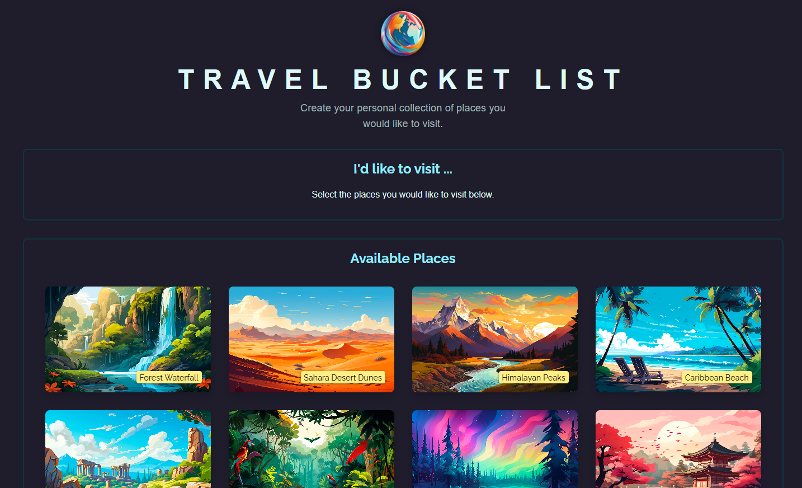
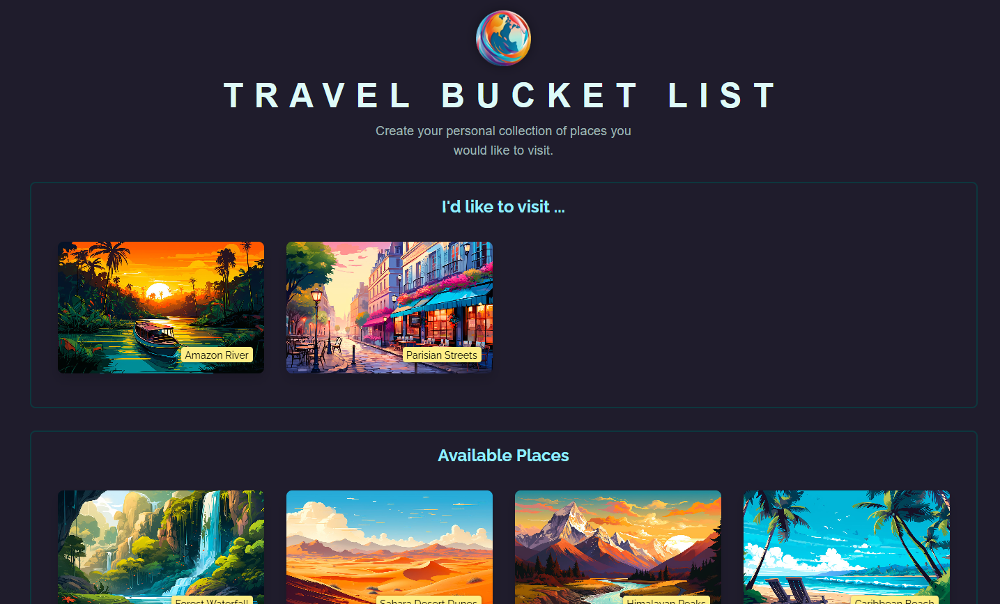
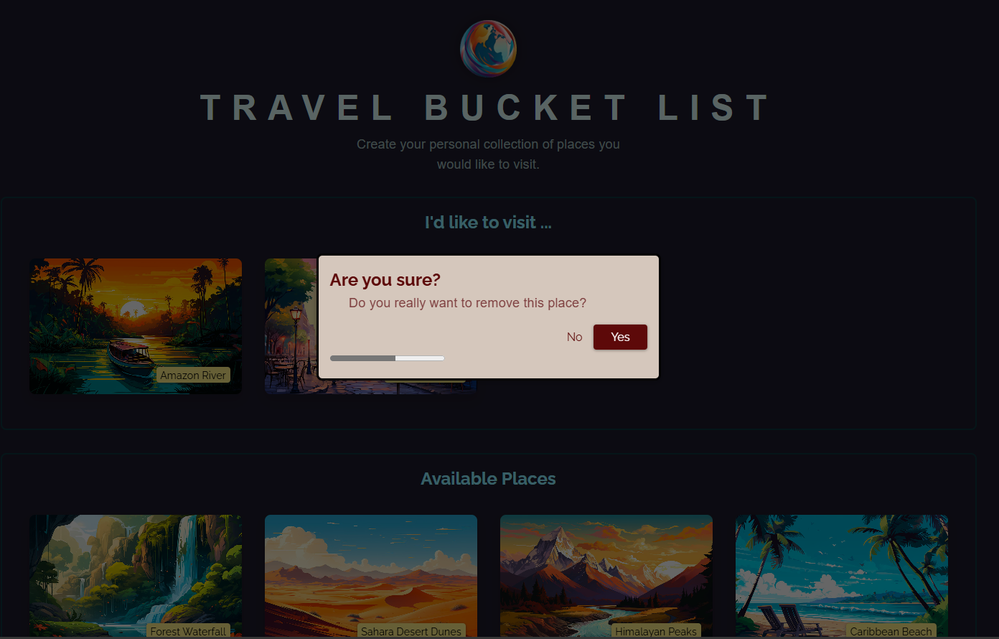

# 🌍 Travel Bucket List App

A full-stack web application that allows users to create and manage their personal collection of travel destinations. Users can choose from a list of available places and mark them as favorites, which are then stored persistently.

**Try Now:** [DEMO](https://rehman308.github.io/travel-bucket-list)

<div  style="display: flex; flex-direction: column; gap:10px ;align-items: center;">



</div>

## 🚀 Features

- 🗺️ Browse a list of available travel destinations
- 🌐 Sort places based on user’s current location (nearest first)
- ⭐ Add and remove places from your bucket list
- 🔄 Persist user selections using local JSON files (backend)
- 📡 Simple Express.js backend with RESTful API endpoints
- 🔧 Graceful error handling and loading states

## 🧑‍💻 Technologies Used

### Frontend

- React (with Hooks)
- JSX Components (App, AvailablePlaces, Modal, ErrorPage, etc.)
- CSS (basic styling)

### Backend

- Node.js
- Express.js
- RESTful APIs
- File System (fs/promises)

## 📂 Project Structure

```
📦 travel-bucket-list
┣ 📂 backend
┃ ┣ 📂 data
┃ ┣ 📂 images
┃ ┣ 📜 app.jsx
┣ 📂 public
┣ 📂 src
┃ ┣ 📂 components
┃ ┃ ┣ 📜 AvailablePlaces.jsx
┃ ┃ ┣ 📜 DeleteConfirmation.jsx
┃ ┃ ┣ 📜 ErrorPage.jsx
┃ ┃ ┣ 📜 Modal.jsx
┃ ┃ ┣ 📜 Places.jsx
┃ ┃ ┣ 📜 ProgressBar.jsx
┃ ┣ 📂 utils
┃ ┣ 📜 App.jsx
┃ ┣ 📜 main.jsx
┣ 📜 package.json
┣ 📜 README.md
```

## 🧩 Running with Backend (Enable Full Functionality)

If you're running this project **locally with the backend server**, make sure to **uncomment the code in below files** in the frontend components. These are commented out by default to allow the app to run as a static demo on GitHub Pages (which does not support backend APIs).

```
App.jsx
AvailablePlaces.jsx
Places.jsx
```

## ⚙️ Setup Instructions

### 1. Clone the Repository

```
git clone https://github.com/rehman308/travel-bucket-list.git
cd travel-bucket-list
```

### 2. Install Dependencies

#### Backend (Express server)

```
cd backend
npm install
```

#### Frontend (React app)

```
cd ../frontend
npm install
```

### 3. Run the App

#### Start Backend Server

```
cd backend
node app.js
# Runs on http://localhost:3000
```

#### Start React Frontend

```
cd ../frontend
npm run dev
# Runs on http://localhost:5173
```

## 📡 API Endpoints

### `GET /places`

Returns the list of all available places from `places.json`.

### `GET /user-places`

Returns the list of places the user has selected from `user-places.json`.

### `PUT /user-places`

Accepts an updated list of selected places and writes it to `user-places.json`.

**Request Body:**
{
"places": [ /* array of place objects */ ]
}

## 📝 License

MIT License. Feel free to use and modify for your own projects!
